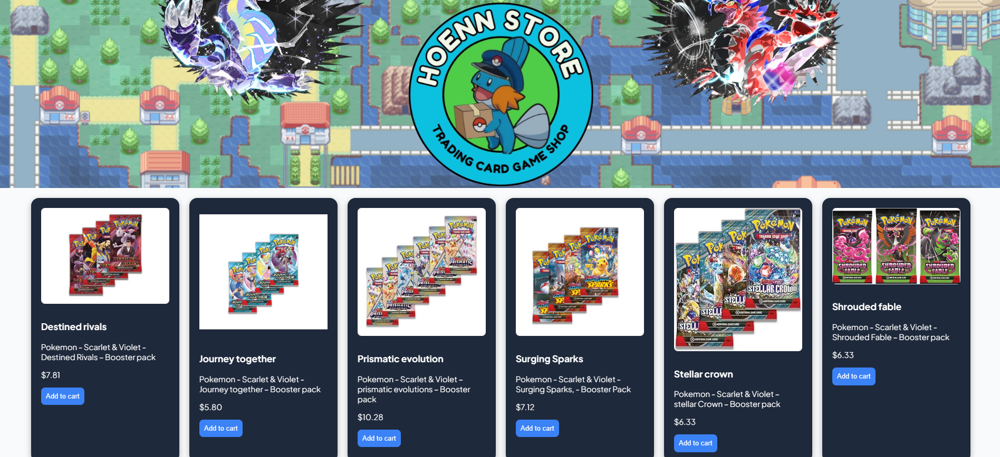
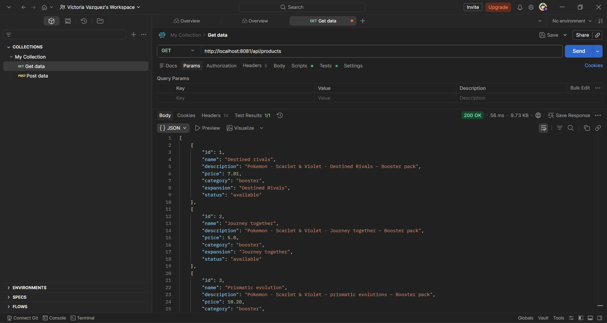
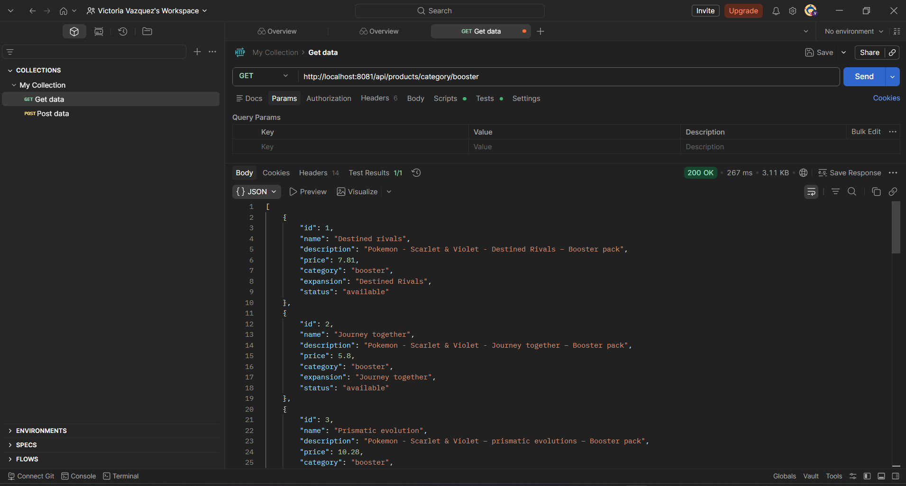

# 🛒 TCG Store API – Spring Boot REST Backend for E-commerce

REST API built with Spring Boot for managing products in a Trading Card Game (TCG) e-commerce system. 
Designed to serve as a backend service for frontend applications.

---

## 🚀 Technologies
- Java 17
- Spring Boot
- Spring Data JPA
- MySQL
- Maven

---

## 🖥️ Frontend

Aplicación web que consume la API y muestra productos dinámicamente.

## 📸 Evidence

### Vista principal


---

## 📦 Features
✔ Get products by category  
✔ MySQL database connection  
✔ REST API ready to be consumed by a frontend  

---

## 🔗 Endpoints

### Get products by category
GET /products/category/{category}

📌 Example:
http://localhost:8080/products/category/pokemon

---

## 🖼️ Screenshots

### Database


### Endpoint in Postman


---

## 📁 Project Structure

src/
 ├── controller/
 ├── model/
 ├── repository/
 └── service/

 ---

# 🛒 TCG Store API – Spring Boot REST Backend for E-commerce

REST API built with Spring Boot for managing products in a Trading Card Game (TCG) e-commerce system. 
Designed to serve as a backend service for frontend applications.

🎮 Pokémon TCG online store project developed with **Java Spring Boot**, **MySQL**, **HTML**, **CSS** y **JavaScript**.

💡 **Project Description:**  
Hoenn TCG Store is an interactive e-commerce platform where users can browse, filter, and purchase Pokémon Trading Card Game products. It features a dynamic shopping cart, user authentication, and product management by category and expansion. Ideal for demonstrating full-stack development skills with Java and frontend technologies.

---

## ⚡ Features

-🔐 User login and registration
-🛒 Dynamic shopping cart
-📦 Product display by category and expansion

---

## 💻 Local Setup

1. **Clone the repository:**
```bash
git clone https://github.com/victoriaDewitt/eccomerce-tcg.git
```


2. **Configure the MySQL database:**

- Create a database named `shop_card`

- Copy `application.properties.example `to `application.properties` and fill in your credentials:
```Properties
spring.datasource.url=jdbc:mysql://localhost:3306/shop_card
spring.datasource.username=YOUR_USER
spring.datasource.password=YOUR_PASSWORD
```

3. **Run the project with Maven:**
```bash
mvn spring-boot:run
```

4. **Open the frontend in your browser **(`index.html`) and test the store.

---


## 📝 Usage

-👤 Register an account or log in
-🔍 Browse products by category or expansion
-🛒 Add products to the cart and check the total

---


# 🛒 TCG Store API – Spring Boot REST Backend for E-commerce

🎮 Proyecto de tienda online de cartas Pokémon (TCG) desarrollado con **Java Spring Boot**, **MySQL**, **HTML**, **CSS** y **JavaScript**.
💡 **Descripción del proyecto:**  
Hoenn TCG Store es una plataforma de comercio electrónico interactiva donde los usuarios pueden explorar, filtrar y comprar productos del Juego de Cartas Coleccionables de Pokémon. Cuenta con carrito de compras dinámico, autenticación de usuarios y gestión de productos por categoría y expansión. Ideal para demostrar habilidades de desarrollo full-stack con Java y tecnologías frontend.

---

## ⚡ Funcionalidades
- 🔐 Login y registro de usuarios
- 🛒 Carrito de compras dinámico
- 📦 Visualización de productos por categoría y expansión

---

## 💻 Instalación local

1. **Clonar el repositorio:**
```bash
   git clone https://github.com/victoriaDewitt/eccomerce-tcg.git
   ```


2. **Configurar la base de datos MySQL:**

-Crear la base de datos `shop_card`
-Copiar `application.properties.example` a `application.properties` y completar tus credenciales:
```Properties
spring.datasource.url=jdbc:mysql://localhost:3306/shop_card
spring.datasource.username=TU_USUARIO
spring.datasource.password=TU_CONTRASEÑA
```

3. **Ejecutar el proyecto con Maven:**
```bash
mvn spring-boot:run
```

4.** Abrir el frontend en tu navegador **(`index.html`) y probar la tienda.

---
## 📁 Project Structure

src/
 ├── controller/
 ├── model/
 ├── repository/
 └── service/
 
---

## 📝 Uso

-👤 Registrar un usuario o iniciar sesión
-🔍 Explorar productos por categoría o expansión
-🛒 Agregar productos al carrito y revisar el total
